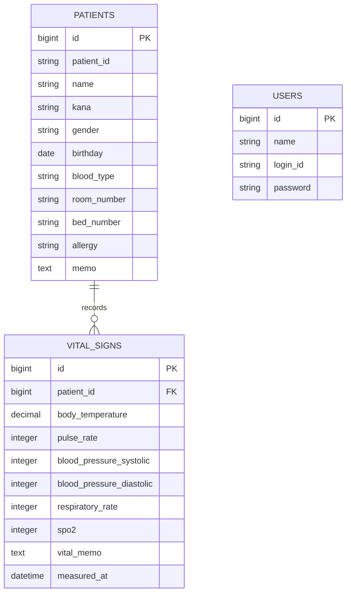
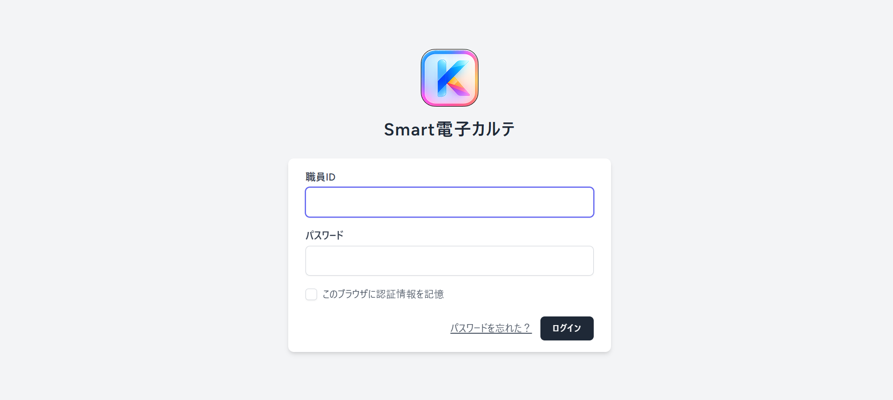
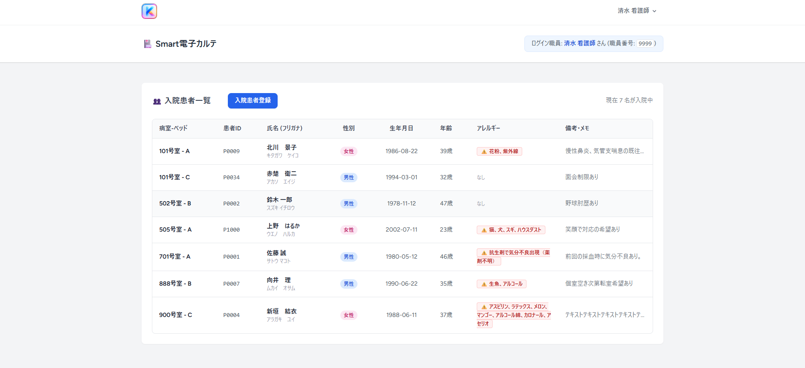
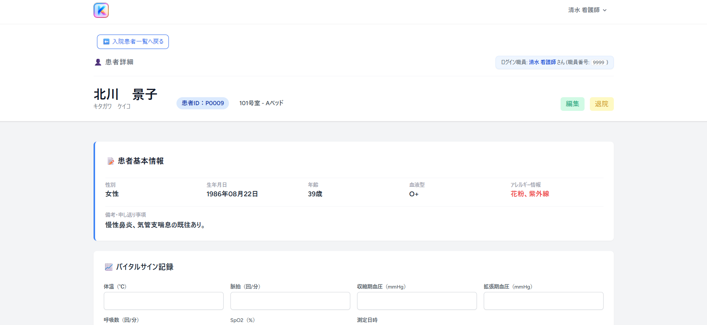
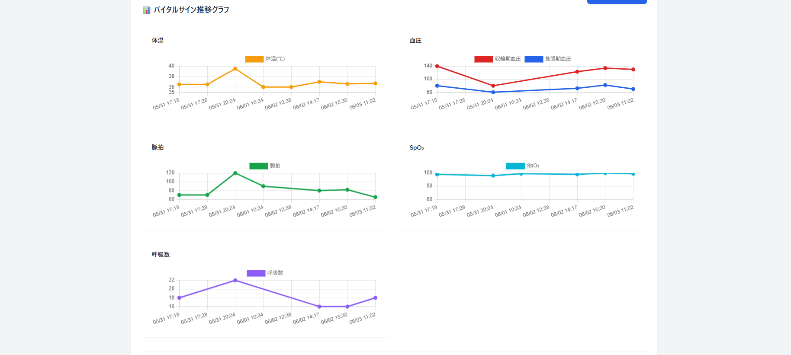

# Smart電子カルテ

## 概要
- 病棟看護師向けの簡易的な電子カルテシステムです。
- 患者情報の管理とバイタルサイン記録を行い、体温・血圧・脈拍・SpO₂・呼吸数の推移をグラフで確認できます。

## 開発背景
- 看護師として従事していたときに使用していた電子カルテを参考に、現場で必要な機能を自分なりに実装しました。
  
## 主な機能
- スタッフログイン機能
- 患者一覧表示
- 患者入院（追加）処理
- 患者退院（削除）処理
- 患者基本情報登録
- 患者基本情報編集
- バイタルサイン記録
- バイタル履歴閲覧
- バイタル推移グラフ表示

## 使用技術スタック
- PHP v8.5.6
- Laravel v13.9.0
- MySQL  v8.4.9
- Docker
- Blade
- Tailwind CSS
- Chart.js
- Git
- GitHub
- Figma
- Googleスプレッドシート

## データベース設計

### 主なテーブル

- users
- patients
- vital_signs

## ER図

## 画面構成

- ログイン画面
    - 患者一覧画面
        - 患者詳細画面
        - 患者情報編集
        - バイタル記録
        - バイタル推移グラフ

## 画面イメージ

### ログイン画面

### 患者一覧画面

### 患者詳細画面

### バイタル推移グラフ

  
## 工夫した点
### バイタルサインの可視化
- Chart.jsを使用し、体温・血圧・脈拍・SpO₂・呼吸数を折れ線グラフで表示できるようにした。

### データの時系列管理
- 測定日時を基準に昇順で取得し、医療現場で確認しやすいように古いデータから新しいデータへ表示した。
- タイムリーに記録できなかった場合でも、過去の時刻の分もデータ入力できるようにした。

### UI改善
- Tailwind CSSを使用し、病室番号や患者IDを視認しやすいデザインにした。
- アレルギー情報は赤文字にし、注意が向くようにした。

## 今後の改善点
- 異常値アラート機能
- モバイル対応

